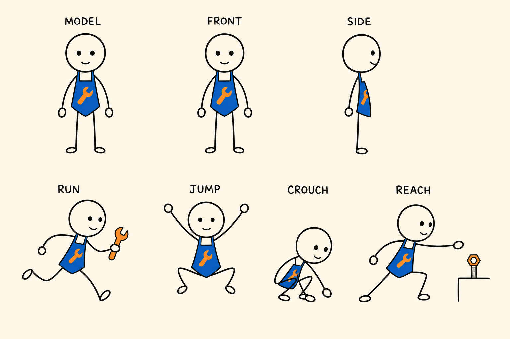
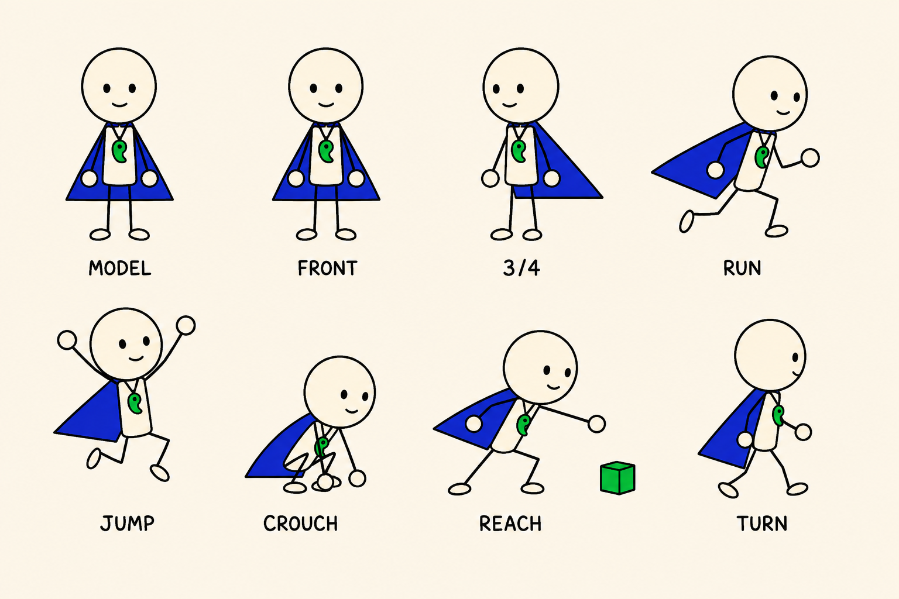

# sayelf-handdraw-story

A schema-first Codex skill for turning stories into consistent hand-drawn video plans.

## Status

`v0.1.0` Core contract + Storyleaf Lite 1.1.0 + optional Illustrator visual-director plugin. The repository defines planning contracts and visual-direction rules; image/video generation remains provider-side. The local WebUI can display provider-returned image and video previews without exposing hidden project JSON.

## Storyleaf Lite 1.1.0

`storyleaf/` 是面向普通用户的独立故事生成产品：输入一句灵感或一篇文章，按故事复杂度自动拆分连续帧；每张图片与一个视频分镜严格对应。它提供预览窗口、沉浸式手绘回放、人物与道具连续性锁、SVG/PNG 图片出口和视频分镜出口，并支持 9:16、3:4、16:9、1:1 画幅。

- [打开故事生成器](storyleaf/一叶故事.html)
- [产品 README](storyleaf/README.md)
- [独立 Skill](storyleaf/storyleaf/SKILL.md)

### 手绘风格参考：风筝


这张参考图用于说明留白、线条和暖色点睛的视觉方向；实际故事会依据自己的连续性锁重新生成角色、动物、器物与场景。

### 默认主角参考：C 云朵机械师（极简版）



圆头、两只点状眼睛、线条四肢、钴蓝围裙和橙色扳手标记组成固定身份；跑、跳、蹲、伸手、转身等复杂动作只改变姿势与道具状态。选定 C 后，可在不同室内外场景复用同一角色。

### 默认主角 2：D 潮汐守望者（极简版）



光头、两只点状眼睛、纯色高饱和靛蓝三角披风、明亮玉绿色简化靴和中国古代刀币形玉坠组成固定身份，底色统一为暖象牙；不使用渐变或额外色相。跑、跳、蹲、伸手、转身等复杂动作只改变姿势与道具状态。场景可以自由切换，刀币玉坠始终保持弯曲方向、大小与胸前高度。

### 故事图片示范：最后一根稻草

这组原创草图把一个故事拆成五个连续瞬间：负重前行 → 膝盖发颤 → 稻草落下 → 前腿弯曲 → 跪地余韵。图片和视频分镜使用同一组编号。

| F001 · 负重前行 | F002 · 膝盖发颤 |
|---|---|
|  |  |

| F003 · 稻草落下 | F004 · 前腿弯曲 |
|---|---|
|  |  |

| F005 · 跪地余韵 |
|---|
|  |

### 连续故事总览（原创生成图）


五帧总览图保持同一只骆驼、两只眼睛、同一套驮具、同一条沙路和同一光线，只推进动作与稻草状态。

## Illustrator 视觉导演插件

`plugins/illustrator/` 将 `sayelf-illustrator` 的可复用能力接入故事 Core：动作 + 道具 + 痕迹证据装配、高饱和手绘风格矩阵、多 Provider 路由，以及出图后焦点物一致性校验。它保持为可替换插件，不改变 Core 的故事结构与连续性契约。

- [视觉导演 Skill](plugins/illustrator/SKILL.md)
- [风格矩阵](plugins/illustrator/references/style-matrix.md)
- [离线连续故事桥接器](plugins/illustrator/scripts/story_to_prompts.py)
- [插件说明](plugins/illustrator/README.md)

桥接器读取 `storyleaf/` 或 `examples/story-sequence/` 的 JSON，输出同编号的图片提示词与视频分镜；默认不联网，只有执行 `execute.py` 或 `loop.py` 并提供用户自己的密钥时才调用 Provider。

## Repository contract

- `SKILL.md` — skill entry point and frozen product boundary.
- `schemas/` — JSON Schema contracts for project planning data.
- `rules/visual_director_rules.yaml` — continuity and staging rules.
- `styles/warm_handdraw_story_v1.yaml` — bundled style profile.
- `scripts/validate_repository.py` — dependency-free repository validation.
- `core/continuity.mjs` — deterministic project, reference, timeline, and continuity checks.
- `interfaces/cli/index.mjs` — local `validate` and `continuity` commands.
- `interfaces/web/` — private local WebUI and JSON API using Node.js standard libraries.
- `examples/story-sequence/` — two consecutive project snapshots.
- `tests/` — Node built-in regression tests.
- `docs/validation/DAY30_REVIEW.md` — evidence-based maintenance review.

## Validate

```text
python scripts/validate_repository.py
```

The command checks that every required artifact exists, JSON Schemas parse and declare Draft 2020-12, YAML assets contain their required top-level keys, and the skill entry point has valid frontmatter.

Run the executable continuity tests with Node.js 20 or newer:

```text
npm test
npm run validate:example
npm run continuity:example
python -m unittest discover -s plugins/illustrator/tests -v
npm run web
```

## Use as an AI-platform plugin

The repository includes a standard Codex plugin manifest at `.codex-plugin/plugin.json`. In Codex, install or link the repository as a local plugin through your configured local marketplace, then start a new thread so Codex loads `SKILL.md`. The skill provides the planning contract; the CLI provides deterministic validation:

```text
node interfaces/cli/index.mjs validate examples/story-sequence/shot-01.json
node interfaces/cli/index.mjs continuity examples/story-sequence/shot-02.json --previous examples/story-sequence/shot-01.json
```

For Claude Code, point the project at the same `SKILL.md` and use the repository CLI. For WorkBuddy or another MCP-capable harness, keep the WebUI server as the local orchestration surface and register its trusted MCP/API adapter; provider credentials remain in the server environment. The core skill never depends on Codex, Claude Code, or WorkBuddy.

Then open `http://127.0.0.1:4175`. The WebUI accepts natural-language story instructions; structured JSON stays inside the local server process. If a Harness returns a `media` array, generated image previews and native video playback appear in the conversation.

The default WebUI is now a bilingual natural-language workspace. Project JSON remains server-side and the browser receives only a validated summary. A local guide is always available; external AI harnesses are disabled until explicitly allowlisted:

```text
SAYELF_HARNESS_ALLOW=codex,claude-code,workbuddy
```

Built-in plugin manifests live in `plugins/harness/`. Additional trusted manifests can be loaded with `SAYELF_PLUGIN_DIR`. Supported transports are shell-free CLI execution, HTTP APIs, and Streamable HTTP MCP. API keys are read from environment variables declared by server-side manifests and are never returned to the browser. Disconnected external harnesses can be connected from the WebUI through a human authorization step: open the configured authorization link, complete provider login or CLI sign-in, then confirm in the WebUI.

`validate` reports broken identifiers, references, and timeline ranges. `continuity` additionally compares stable character, prop, style, scene-location, and scene-time fields with a previous snapshot. A report is either `PASS` or `REVISE`; the CLI exits with code `2` for a revision request.

## Frozen boundary

Connected CLI harnesses also support live sessions. The WebUI keeps an SSE event stream open for incremental assistant output, sends follow-up user messages to the same session, and applies each completed turn to the hidden workspace. The raw session endpoints are `/api/live-sessions`, `/api/live-sessions/:id/events`, and `/api/live-sessions/:id/messages`.

The WebUI uses a local-first assistant for deterministic requests such as continuity checks, project status, and preview-state queries. These requests are answered by the local validator and do not consume model tokens; creative story changes still go to the selected Harness.

Allowed in `v0.1.x`: bug fixes, schema corrections, tests, validation evidence, and documentation. New renderers, providers, editing surfaces, platforms, and workflow layers require a separately validated version proposal.
