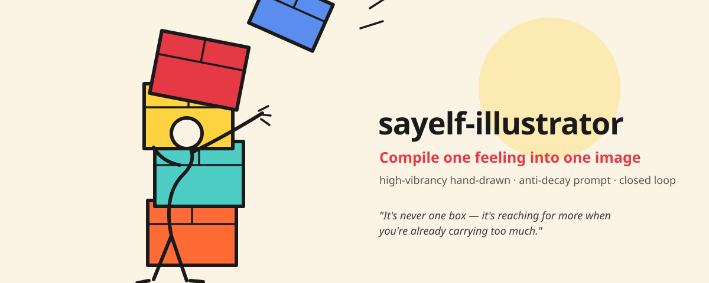

<p align="center">
  
</p>

<h1 align="center">sayelf-illustrator</h1>

<p align="center">
  <b>把一句感受，编译成一张画。</b><br>
  一台 AI 插画导演 · 高饱和手绘 · 防衰减 Prompt · 出图一致性闭环
</p>

<p align="center">
  <a href="#快速上手">快速上手</a> ·
  <a href="#它解决什么">它解决什么</a> ·
  <a href="#系统架构">架构</a> ·
  <a href="#风格矩阵">风格</a> ·
  <a href="#出图-provider">Provider</a>
</p>

---

## 一句话

> 观众记住的从来不是形容词，而是一个「动作 + 道具 + 痕迹」构成的瞬间。
> 导演的活儿，是把抽象的「感受」翻译成可以被画出来的「证据」。

`sayelf-illustrator` 是一款以 OpenClaw SKILL.md 形式交付的插画导演系统。喂给它一句
痛点 / 金句 / 脚本，它把抽象概念解构成可画的证据，装配成防衰减的高饱和手绘 Prompt，
接文生图 API 出图，再回读成图确认焦点物真的进了画面——不达标自动换 seed 重出。

接入 Claude Code / Codex / OpenClaw / Workbuddy 后即可直接调用。

本目录是 `sayelf-illustrator` 能力在 `sayelf-handdraw-story` 中的可替换插件边界：故事 Core 负责结构与连续性，本插件负责视觉证据、手绘风格、Provider 路由和出图后焦点物校验。所有脚本默认离线，只有显式执行出图命令且提供密钥时才会联网。

## 它解决什么

三个最容易把 AI 配图做废的坑，这里都用代码写死了防线：

- **叙事与画面解耦** —— 抽象词直接进画面会产出「机器人打斗里很安静」。这里强制
  `subject + action + prop` 同框，缺一即显式报错，焦点道具必进 prompt。
- **Prompt 权重方言错配** —— `(word:1.15)` 是 SD/ComfyUI 方言，发给自然语言模型只会降质。
  路由按方言分流：NL 模型剥净权重，只有 SDXL 保留权重语法 + 独立 negative。
- **出图不可控** —— 出完不知道画对没画对。闭环回读成图、逼视觉模型回
  `{present, confidence}` JSON 判焦点物命中，不达标换 seed 重出，用尽仍不过如实报失败。

## 快速上手

```bash
# 0) 当前统一仓库中的插件目录：plugins/illustrator/

# 1) 只出 Prompt 计划（host-first，最安全；宿主自带出图工具时用这个）
python plugins/illustrator/scripts/assemble_prompt.py --demo

# 2) 接文生图自动出图（先 export 对应 key）
export GEMINI_API_KEY=...
python plugins/illustrator/scripts/assemble_prompt.py --demo \
  | python plugins/illustrator/scripts/execute.py --from-plan --provider gemini --out ./out.png

# 3) 完整闭环：保证焦点道具进画面（装配→出图→验→不过重出）
python plugins/illustrator/scripts/loop.py \
  --subject "a tired man bent under the weight" \
  --action "reaching out to catch another falling box" \
  --prop "a towering stack of oversized cardboard boxes" \
  --trace "the top box already tilting and slipping free" \
  --style pen_line_vibrant --provider gemini --vision gemini \
  --max-attempts 3 --out ./out.png

# 上线前先离线核对请求（key 脱敏，不发送）
python plugins/illustrator/scripts/execute.py --provider all --prompt "test" --dry-run
```

### 接入连续故事

Storyleaf 或 canonical 项目先由故事 Core 决定帧数，再用桥接器为每帧生成同编号图片提示词与视频分镜。桥接器不会出图，也不会上传文章：

```bash
python plugins/illustrator/scripts/story_to_prompts.py \
  --story storyleaf/完整Demo/最后一根稻草.json \
  --subject "the same sand-brown one-humped camel, both eyes visible" \
  --prop "red load rope, blue rolled blanket, square wicker basket, one golden straw" \
  --style pen_line_vibrant --model gemini --out ./storyleaf-plan.json
```

输出中的 `image_ids` 与 `video_ids` 必须完全相同；`continuity_lock` 记录跨帧主体、道具和痕迹，便于后续 Provider 或人工复核。

## 系统架构

```
一句感受
   │
   ▼  ① 语义解构      抽象痛点 → 动作 Action + 道具 Prop + 痕迹 Trace
   ▼  ② 叙事模式      单图 Hook 金句  /  四格 起·承·转·合
   ▼  ③ 防衰减装配    Hard Constraints → Evidence → Composition → Style（顺序即防衰减）
   ▼  ④ 出图路由      Gemini → OpenAI → 万相 → 即梦（SDXL 兜底 / MJ 预留位）
   ▼  ⑤ 一致性闭环    回读成图验焦点物 → 不达标换 seed 重出
   ▼
成图（焦点道具已确认进画面）
```

## 风格矩阵

五档高饱和 / 高明度手绘，共享同一 Style DNA
（高纯度·高饱和·高明度·零灰污·暖象牙白基底·深炭黑结构·低噪·大留白·一图一情绪）：

| key | 风格 | 适合 |
|-----|------|------|
| `pen_line_vibrant` | 钢笔线描（沉浸） | 需要线条叙事感的痛点金句 |
| `marker_line` | 马克笔线描（粗犷） | 街头随性、生活流 |
| `color_block_frame` | 色块线框（撞色海报） | 观点鲜明的 Hook |
| `vibrant_pure_block` | 纯色高亮（平涂戏剧光） | 强戏剧冲突、极简高级 |
| `gouache_pop` | 不透明水粉（厚重浓郁） | 温度感、情绪厚度 |

详见 [`references/style-matrix.md`](references/style-matrix.md)。

## 出图 Provider

| provider | 现役模型 | key 环境变量 | 状态 |
|----------|----------|--------------|------|
| gemini | gemini-3.1-flash-image (Nano Banana 2) | `GEMINI_API_KEY` | ✅ 已接线 |
| openai | gpt-image-2（DALL-E 3 已退役） | `OPENAI_API_KEY` | ✅ 已接线 |
| qwen | 通义万相 wan2.6-image | `DASHSCOPE_API_KEY` | ✅ 已接线 |
| seedream | 即梦 doubao-seedream-4 | `ARK_API_KEY` | ✅ 已接线 |
| midjourney | —— | `MJ_API_KEY` | 🔒 预留位（无官方公开 API） |

> **零密钥入体**：本体不含任何 API key，全部从环境变量读，创作逻辑本地化。
> 模型漂移时用 `AIVD_<PROVIDER>_MODEL` / `AIVD_<PROVIDER>_BASE` 覆盖，无需改代码。

## 目录结构

```
sayelf-illustrator/
├── SKILL.md                     # 导演手册（六步工作流）
├── assets/hero.svg              # 首页插画（本系统风格自示范）
├── references/style-matrix.md   # 五档风格库
└── scripts/
    ├── assemble_prompt.py       # 四步法防衰减装配（确定性、可复现）
    ├── execute.py               # 四家出图 + MJ 预留位
    ├── verify.py                # 焦点物一致性判定
    └── loop.py                  # 装配→出图→验→重试 闭环编排
```

## 设计原则

遵循五大思维框架（费曼 / 第一性原理 / 负熵 / 冰山 / 二阶思维）与九大开发原则；
所有外部图片工具经穿透蒸馏后落地为原生 SKILL.md，禁止直接复制外部代码。

## 品牌

隶属 **[SAYELF.ai](https://sayelf.ai)** — Watch an AI become a Self。

## License

MIT
