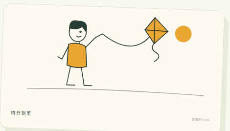
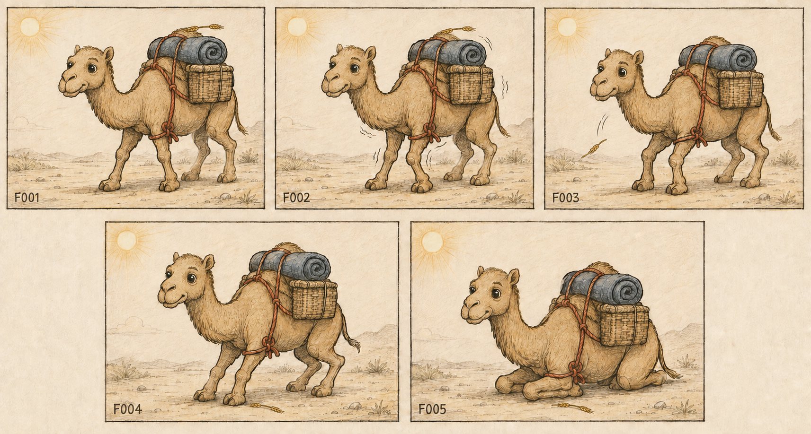

# 一叶故事 1.1

把点子或文章，变成可修改的连续故事分镜。

GitHub 仓库：[sayelf-handdraw-story](https://github.com/chuanxituzhu-lab/sayelf-handdraw-story)

## 三步开始
1. 解压全部文件，双击「一叶故事.html」，用桌面浏览器打开。不用注册、安装或联网。
2. 写文字、粘贴文章，或选择一个示范。选喜欢的画风，点「展开我的故事」。
3. 查看并修改每帧。点「预览窗口」放大查看，点「沉浸式播放」或卡片上的「绘制」，观看线条逐步落下、色块随后显现；再下载「图片制作清单」和「视频分镜」，也可逐帧下载 SVG / PNG 草图。

先试「最后一根稻草」，会得到 5 帧。再试「离家」，会得到 3 帧。帧数取决于当前文字里的事件，而不是商品预先限制四帧。视频分镜默认约 2.5 秒一镜，动作较长时自动延长，范围约 1.8–5.5 秒。图片与视频始终来自同一镜头列表。

## 画幅与平台
在输入区选择发布平台或直接选择画幅。支持 9:16 竖屏、3:4 竖幅、16:9 横屏和 1:1 方形；选择平台时会自动匹配常见画幅。竖屏适合短视频，横屏适合普通 YouTube 视频，最终仍以发布平台当时的规格为准。

## 你拿到什么
- 单文件页面：输入、选风格、拆镜、修改、预览、导出。
- storyleaf/SKILL.md：独立 AI 故事创作 Skill，负责理解和扩写具体故事。
- 16 个示范、6 种原创风格示意、3 套调用模板、连续性锁。
- 完整骆驼 Demo：5 张独立 SVG 草图、对应图片提示词与视频分镜、可重开故事文件。

## 故事图片示范：最后一根稻草
这组原创草图把一个故事拆成五个连续瞬间：负重前行 → 膝盖发颤 → 稻草落下 → 前腿弯曲 → 跪地余韵。图片和视频分镜使用同一组编号。

## 手绘风格参考：风筝

这张参考图用于说明留白、线条和暖色点睛的视觉方向；实际故事会依据自己的连续性锁重新生成角色、动物、器物与场景。

| F001 · 负重前行 | F002 · 膝盖发颤 |
|---|---|
|  |  |

| F003 · 稻草落下 | F004 · 前腿弯曲 |
|---|---|
|  |  |

| F005 · 跪地余韵 |
|---|
|  |

### 连续故事总览（原创生成图）

这张五帧总览图沿用同一只骆驼、两只眼睛、红色驮绳、蓝色卷毯、方形藤筐、沙路与左上光；仅让动作和稻草状态随故事推进。

## 两种使用方式
**直接打开 HTML**：本地规则把文章按句子/段落整理为镜头；短点子生成结构草案。适合快速排顺序、查看节奏、改写和导出。这里没有内置大模型；示意图使用原创图形组件，不能精准画出任意剧情。

**让 AI 写具体故事**：将 storyleaf 文件夹装入你使用的工具所支持的 Skill 目录，或直接把 SKILL.md 内容粘贴给已有 AI 对话，再发送点子。宿主需支持长文本指令；不是所有聊天工具都能“安装 Skill”。

页面内也可点「更多出口 → 交给 AI 深化」，下载或复制完整指令。自行确认素材可发送给所选服务后，让 AI 输出故事 JSON；回到页面，用「打开已保存的故事」导入。AI 服务的使用条件和费用不包含在本包中。本包不会自动联系任何服务。

## 可选 AI 生成
点「AI 生成图片 / 视频」打开设置。没有 AI Harness 时，可填写自己的 OpenAI-compatible 接口、模型和本次密钥；支持文生图、文生视频和图生视频。只有点击「开始生成」才会发出请求，密钥不会写入故事 JSON、导出文件或日志。视频接口的字段可能因供应商不同而变化，若返回图片或视频 URL，页面会自动放入预览窗口；不识别的返回格式会明确报错。

## 图片和视频出口是什么
- **SVG/PNG**：页面本地绘制的分镜草图，可独立下载。点击「预览窗口」放大查看，点击「绘制」可看 4 秒逐笔动画；用于节奏与风格示意，画面细节以文字为准。
- **图片制作清单**：逐帧完整指令，交给现有生图工具生成最终图片。不是已渲染的 AI 图片。
- **视频分镜**：每帧的动作、运镜、时长、衔接、声音、画幅，以及对应图片编号。不是 MP4。
- **分镜表 CSV**：可用表格软件打开。
- **故事 JSON**：保存后可重新导入，恢复原文、画风、镜头与连续性约定。

## 文章与修改
支持 UTF-8 TXT、Markdown 及直接粘贴，最多 30,000 字。Word/PDF 请先复制文字。较长文章会把相邻片段组合为最多 32 个初始镜头，保留原文依据；这属于结构整理，需检查是否一镜承载过多内容。可逐帧修改、前移、合并、拆分或删除，最多 200 帧。多章节作品建议分开保存。

“拆为两帧”需要该帧至少两个完整句子。单句先改写成两句再拆分。改变输入会清除旧结果，先保存再替换内容。改变画风会更新已有结果；修改后需要重新下载出口。

## 保存与常见情况
- 刷新或关闭会清空未保存内容；页面不自动持久化个人稿件。
- 自动复制不可用时，弹窗会选中文字，按 Ctrl+C / ⌘C。
- 手机浏览器或聊天软件的内置浏览器可能限制本地文件与下载；推荐使用桌面浏览器。手机未作完整兼容验证。
- PNG 失败可下载 SVG。图片含“分镜草图”标识，避免与最终插画混淆。
- 原创示范不包含第三方图库素材；调研来源见“交付说明/调研与架构.md”。

版本独立、无自动更新；保留旧压缩包即可回退。1.1 的 AI 适配器不代替供应商 SDK，也不托管用户密钥。
